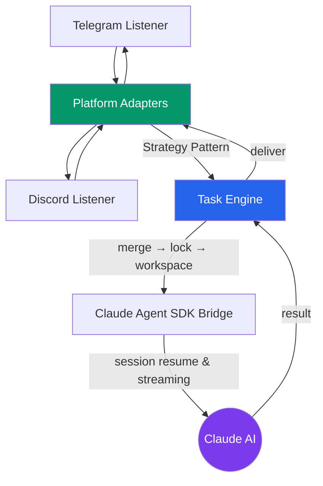
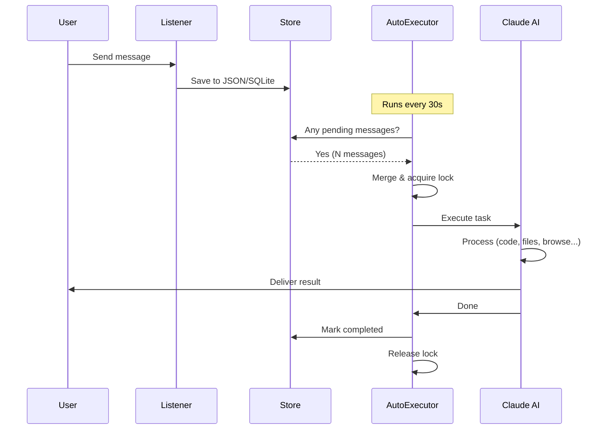
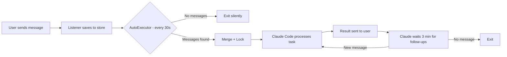
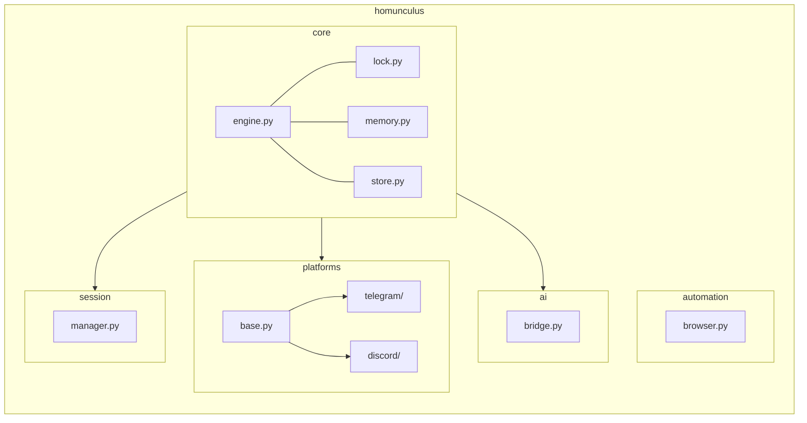
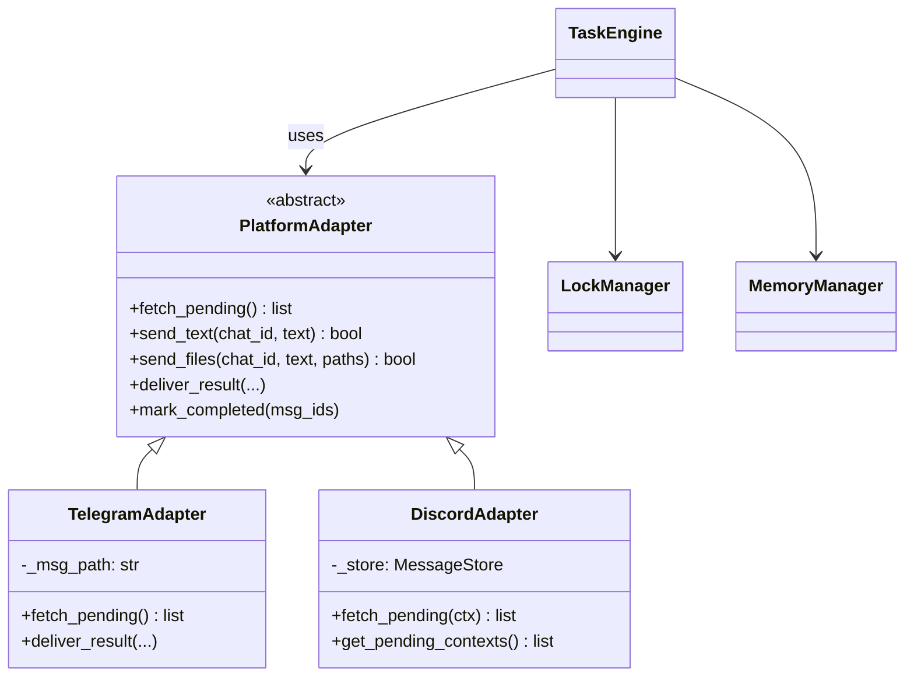

# Super Homunculus Bot

An AI-powered multi-platform chat assistant that bridges **Telegram** and **Discord** with **Claude AI** for autonomous task execution.

Send a message to your bot — it understands natural language, executes code, creates files, browses the web, and reports back with results.

## Architecture



## Message Processing Flow



## Features

- **Multi-platform**: Telegram + Discord with unified task pipeline
- **Session continuity**: AI conversations persist across bot restarts — Claude remembers your prior conversations
- **Concurrent safety**: File-based locks with staleness detection (30-min timeout)
- **Task memory**: Searchable index of all past work with keyword retrieval
- **File support**: Photos, documents, audio, video, voice messages, location sharing
- **Browser automation**: Playwright-based web scraping, screenshots, form filling (optional)
- **Cross-platform**: macOS (launchd), Linux (cron), Windows (Task Scheduler)
- **Stale recovery**: Zombie processes and stuck tasks are auto-detected and cleaned up

## What Can It Do?

Once set up, you can message your bot with requests like:

| Request | What happens |
|---------|-------------|
| "Build me a landing page for my cafe" | Claude creates HTML/CSS files and sends them back |
| "Summarize this PDF" (+ attach file) | Reads the attached file and returns a summary |
| "Take a screenshot of example.com" | Uses browser automation to capture and send the screenshot |
| "What did I ask you yesterday?" | Searches task memory and recalls past conversations |
| "Fix the bug in server.py line 42" | Reads your code, identifies the issue, and applies the fix |

Multiple messages sent while the bot is busy are **automatically merged** and processed together in the next cycle.

---

## Setup Guide

### Prerequisites

- **Python 3.11+** — [Download](https://www.python.org/downloads/)
- **Claude Code CLI** — [Install Guide](https://docs.anthropic.com/en/docs/claude-code)
- A Telegram and/or Discord account

### Step 1: Clone & Install

**macOS / Linux:**
```bash
git clone https://github.com/jskjw157/super_homunculus_bot.git
cd super_homunculus_bot
pip install -e ".[dev]"
```

**Windows:**
```
git clone https://github.com/jskjw157/super_homunculus_bot.git
cd super_homunculus_bot
scripts\setup.bat
```
The setup script will check Python, install dependencies, and create `.env` interactively.

**Optional — Browser automation:**
```bash
pip install -e ".[browser]"
playwright install chromium
```

### Step 2: Create a Telegram Bot

1. Open Telegram and search for **[@BotFather](https://t.me/BotFather)** (look for the blue checkmark)
2. Start a chat and send `/newbot`
3. **Choose a display name** — e.g., "My Homunculus"
4. **Choose a username** — must end with `bot`, e.g., `my_homunculus_bot`
   - 5–32 characters, only Latin letters, numbers, and underscores
5. BotFather replies with your **API token** — looks like:
   ```
   123456789:ABCdefGHIjklMNOpqrSTUvwxYZ
   ```
6. **Copy the token** — you'll need it for `.env`

> **Security:** Your token is your bot's password. Never commit it to Git or share it publicly. If compromised, send `/revoke` to BotFather to generate a new one.

**Optional bot settings via BotFather:**
- `/setdescription` — Set the bot's bio shown before users start chatting
- `/setuserpic` — Upload a profile picture for your bot
- `/setcommands` — Define slash command hints (e.g., `/help - Show help`)
- `/setprivacy` — `Disable` if your bot needs to read all messages in group chats

### Step 3: Create a Discord Bot

1. Go to **[Discord Developer Portal](https://discord.com/developers/applications)** and log in
2. Click **"New Application"** → enter a name (e.g., "Super Homunculus") → **Create**
3. Go to the **"Bot"** tab in the left sidebar
4. Click **"Reset Token"** → **Copy** the token immediately
   - Discord only shows the token once! Save it securely

5. **Enable Privileged Intents** (scroll down on the Bot page):
   - Toggle **Message Content Intent** → ON
   - Toggle **Server Members Intent** → ON (optional, for user info)
   - Click **Save Changes**

   > **Why Message Content Intent?** Without this, your bot receives empty message bodies. It's required for reading what users type.

6. **Generate an invite link** to add the bot to your server:
   - Go to **OAuth2** → **URL Generator** in the left sidebar
   - Under **Scopes**, check: `bot`, `applications.commands`
   - Under **Bot Permissions**, check:
     - Send Messages
     - Send Messages in Threads
     - Attach Files
     - Read Message History
     - Add Reactions
   - Copy the generated URL at the bottom and open it in your browser
   - Select your server and click **Authorize**

> **Note:** Bots in fewer than 100 servers can use Privileged Intents freely. For 100+ servers, you'll need to [apply for verification](https://support-dev.discord.com/hc/en-us/articles/6205754771351).

### Step 4: Configure `.env`

```bash
cp .env.example .env
```

Edit `.env` with your tokens:
```env
# Telegram
TELEGRAM_BOT_TOKEN=123456789:ABCdefGHIjklMNOpqrSTUvwxYZ
TELEGRAM_ALLOWED_USERS=your_user_id
TELEGRAM_POLLING_INTERVAL=10

# Discord
DISCORD_BOT_TOKEN=MTIzNDU2Nzg5.AbCdEf.GhIjKlMnOpQrStUvWxYz
DISCORD_GUILD_ID=your_server_id
DISCORD_ALLOWED_USERS=your_discord_user_id
```

### Step 5: Find Your User ID

**Telegram:**
```bash
python scripts/get_my_id.py
# Send any message to your bot — the script will print your user ID
```

Or message [@RawDataBot](https://t.me/RawDataBot) on Telegram — it replies with your user info including chat ID.

**Discord:**
1. Open Discord Settings → **Advanced** → Enable **Developer Mode**
2. Right-click your username → **Copy User ID**

For server (guild) ID: Right-click the server name → **Copy Server ID**

### Step 6: Start the Bot

**Option A: Manual (for testing)**
```bash
# Terminal 1 — Listener (captures messages)
python -m homunculus.platforms.telegram.listener

# Terminal 2 — Process messages
python scripts/run_telegram.py
```

**Option B: Automatic (recommended for daily use)**

The auto-executor checks for new messages every 30 seconds and launches Claude Code when needed:

| OS | Command | What it does |
|----|---------|-------------|
| macOS | `bash scripts/setup_scheduler.sh` | Registers `launchd` plist (30s interval) |
| Linux | `bash scripts/setup_scheduler.sh` | Adds cron job (1-min interval) |
| Windows | `scripts\register_scheduler.bat` (Run as Admin) | Creates Task Scheduler entry (30s effective) |

**Verify it's running:**
```bash
# macOS
launchctl list | grep homunculus

# Linux
crontab -l | grep autoexecutor

# Windows (PowerShell)
schtasks /Query /TN "Homunculus_*" /FO LIST
```

**View logs:**
```bash
tail -f logs/autoexecutor.log
```

---

## How It Works



1. **Listener** runs continuously, saving incoming messages to JSON (Telegram) or SQLite (Discord)
2. **AutoExecutor** runs every 30 seconds via OS scheduler
3. If pending messages exist, it merges them and acquires a file lock
4. **Claude Code** is launched with the merged instruction
5. Claude processes the task, sending progress updates along the way
6. After completion, Claude waits 3 minutes for follow-up messages before exiting
7. The lock is released and the cycle repeats

---

## Project Structure



| Module | Purpose |
|--------|---------|
| `core/engine.py` | Task orchestration pipeline (merge → lock → workspace → AI) |
| `core/lock.py` | File-based mutual exclusion with heartbeat and stale detection |
| `core/memory.py` | Task workspace management and keyword-searchable index |
| `core/store.py` | SQLite message queue with atomic state transitions |
| `platforms/base.py` | `PlatformAdapter` abstract base class (Strategy Pattern) |
| `platforms/telegram/` | Telegram Bot API adapter, sender, listener |
| `platforms/discord/` | Discord gateway adapter, sender, listener |
| `ai/bridge.py` | Claude Agent SDK wrapper with session resume |
| `automation/browser.py` | Generic Playwright browser automation (8 commands) |
| `session/manager.py` | Multi-platform session persistence across restarts |

## Design Patterns



## Adding a New Platform

1. Create `homunculus/platforms/myplatform/`
2. Implement `MyPlatformAdapter(PlatformAdapter)`
3. Add listener and sender modules
4. Create `scripts/run_myplatform.py`

That's it — the engine and AI bridge work unchanged.

## Troubleshooting

| Problem | Solution |
|---------|----------|
| Bot doesn't respond | Check `logs/autoexecutor.log` for errors |
| "TELEGRAM_BOT_TOKEN not configured" | Verify `.env` file exists and token is correct |
| Discord bot is online but ignores messages | Enable **Message Content Intent** in Developer Portal |
| "Lock already held" | A previous task is still running, or crashed — wait 30 min for auto-recovery, or delete `working.json` |
| Claude Code not found | Install Claude Code CLI: `npm install -g @anthropic-ai/claude-code` |
| Multiple messages not merging | They will be merged in the next processing cycle (within 30s) |

## License

MIT
