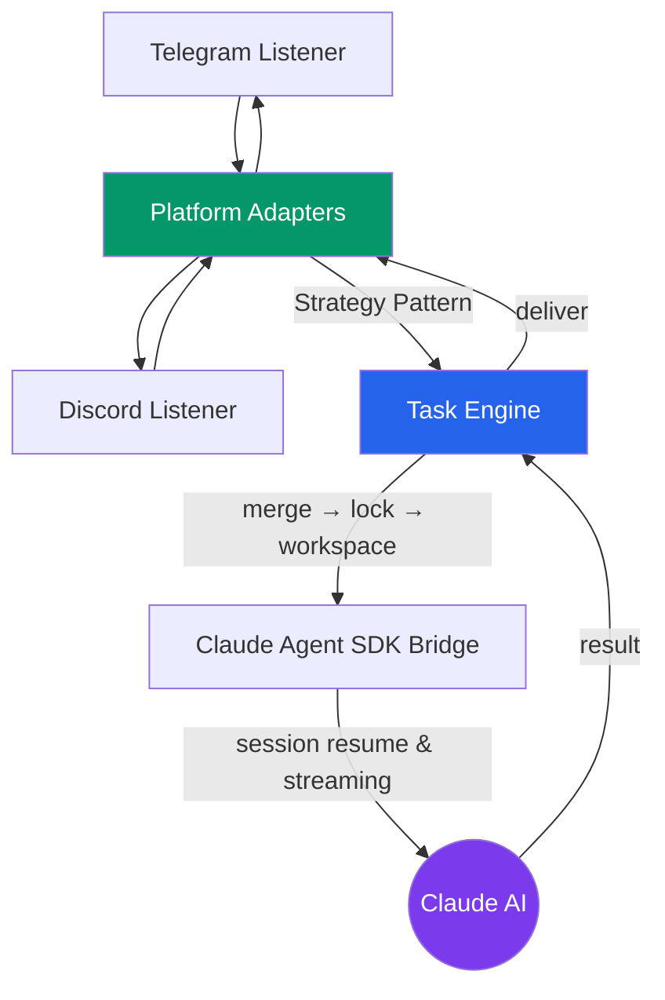
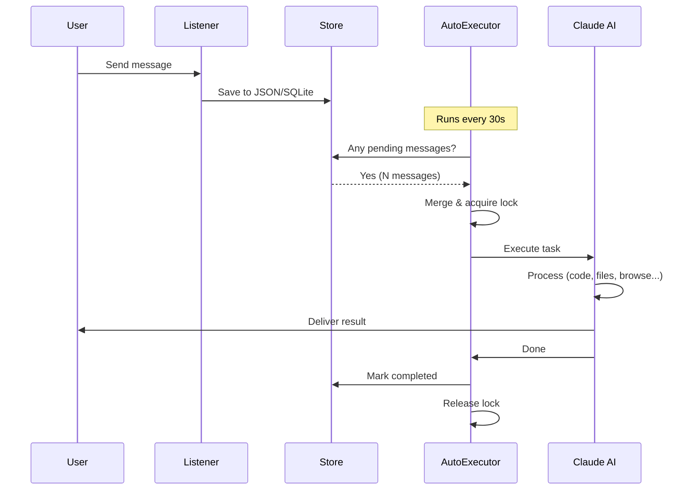
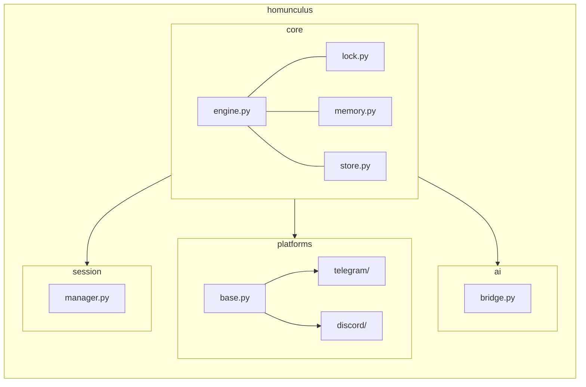
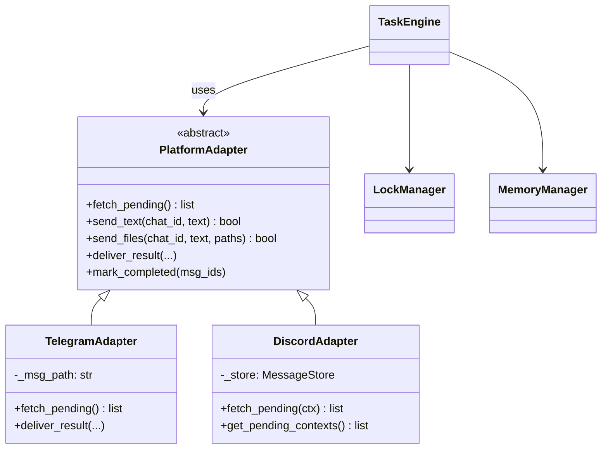

# Super Homunculus Bot

An AI-powered multi-platform chat assistant that bridges **Telegram** and **Discord** with **Claude AI** for autonomous task execution.

Send a message to your bot — it understands natural language, executes code, creates files, browses the web, and reports back with results.

## Architecture



## Message Processing Flow



## Features

- **Multi-platform**: Telegram + Discord with unified task pipeline
- **Session continuity**: AI conversations persist across bot restarts
- **Concurrent safety**: File-based locks with staleness detection
- **Task memory**: Searchable index of all past work with keyword retrieval
- **File support**: Photos, documents, audio, video, location sharing
- **Cross-platform**: macOS (launchd), Linux (cron), Windows (Task Scheduler)

## Quick Start

### 1. Clone & Install

```bash
git clone https://github.com/your-username/super_homunculus_bot.git
cd super_homunculus_bot
pip install -e ".[dev]"
```

**Windows:** Double-click `scripts\setup.bat` instead.

### 2. Configure

```bash
cp .env.example .env
# Edit .env with your bot tokens
```

**Get your Telegram bot token:**
1. Message [@BotFather](https://t.me/BotFather) on Telegram
2. Send `/newbot` and follow the prompts
3. Copy the token to `.env`

**Get your Discord bot token:**
1. Go to [Discord Developer Portal](https://discord.com/developers/applications)
2. Create a new application → Bot → Copy token
3. Enable **Message Content Intent** under Bot settings

**Find your user ID:**
```bash
python scripts/get_my_id.py
```

### 3. Start Listeners

```bash
# Telegram (in one terminal)
python -m homunculus.platforms.telegram.listener

# Discord (in another terminal)
python -m homunculus.platforms.discord.listener
```

### 4. Process Messages

```bash
# One-shot processing
python scripts/run_telegram.py
python scripts/run_discord.py

# Or set up scheduled execution (auto-check every 30s)
bash scripts/setup_scheduler.sh          # macOS / Linux
scripts\register_scheduler.bat           # Windows (run as admin)
```

## Project Structure



## Design Patterns



## Adding a New Platform

1. Create `homunculus/platforms/myplatform/`
2. Implement `MyPlatformAdapter(PlatformAdapter)`
3. Add listener and sender modules
4. Create `scripts/run_myplatform.py`

That's it — the engine and AI bridge work unchanged.

## Requirements

- Python 3.11+
- [Claude Code CLI](https://docs.anthropic.com/en/docs/claude-code) (for AI execution)
- Telegram/Discord bot tokens

## License

MIT
