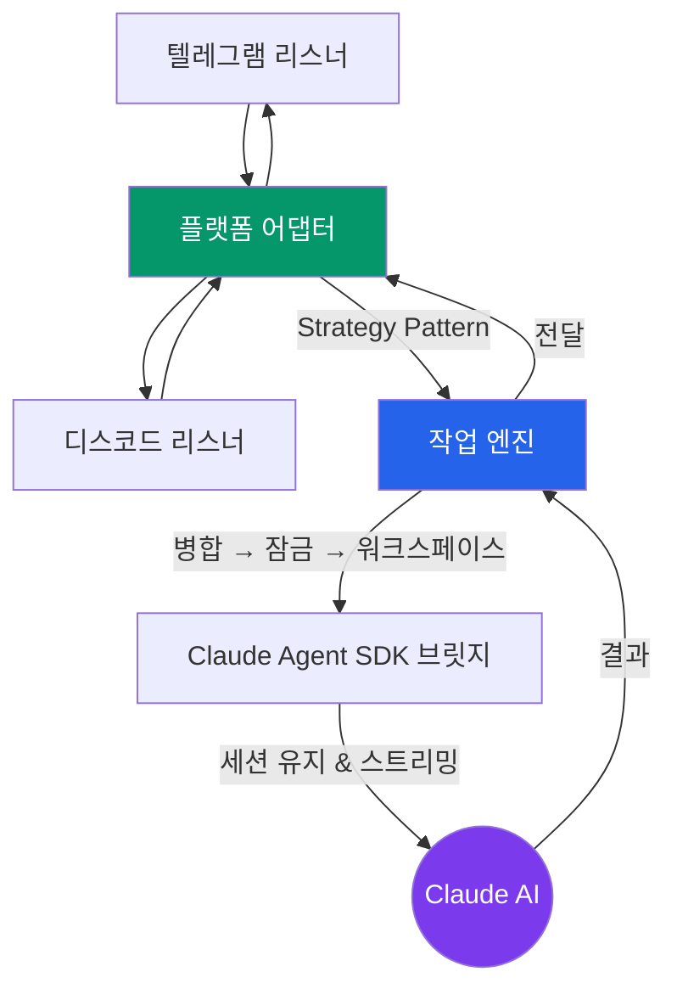
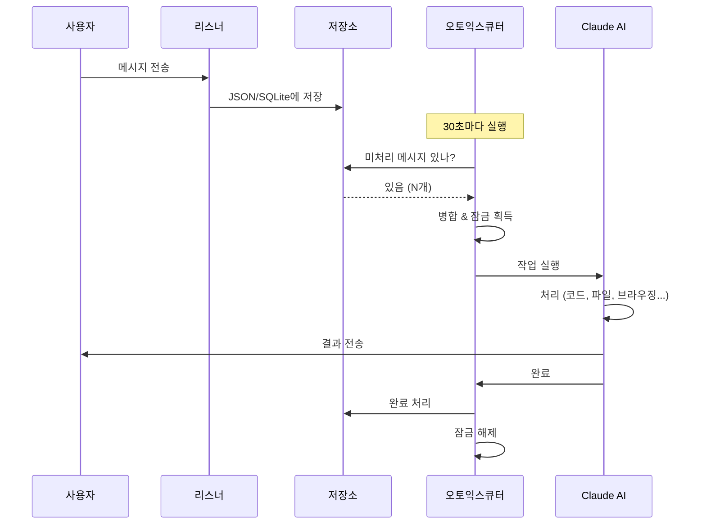
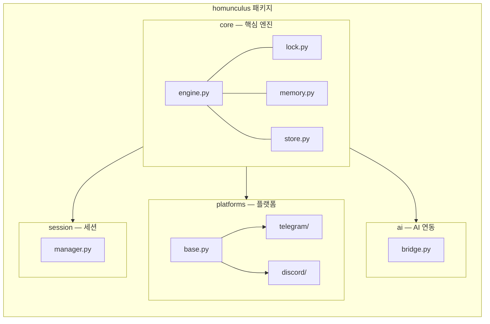
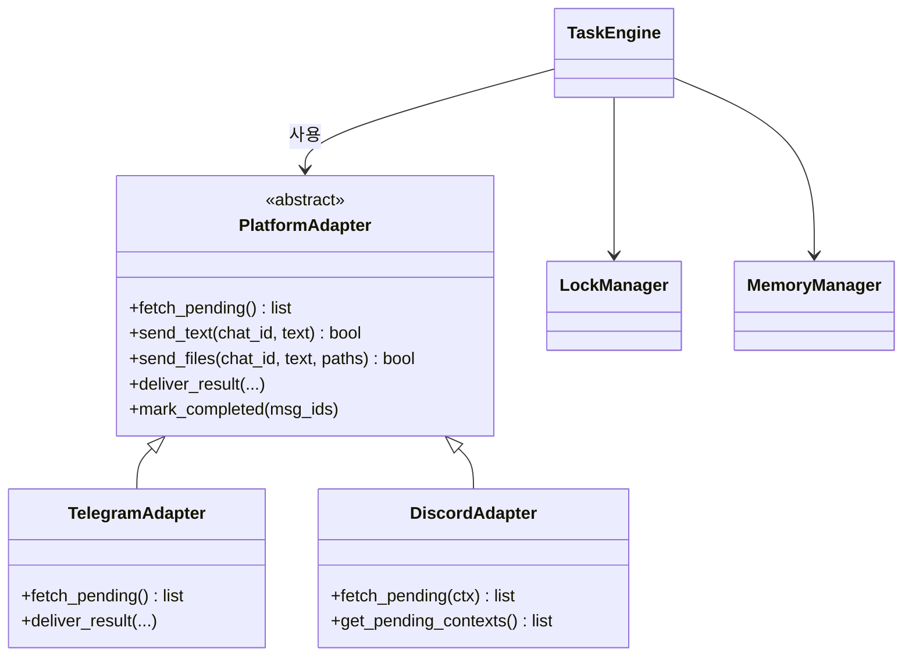

# Super Homunculus Bot

Claude AI 기반 멀티 플랫폼 챗봇 어시스턴트. **텔레그램**과 **디스코드**에서 자연어로 명령하면, AI가 코드 작성, 파일 생성, 웹 브라우징 등을 자율 수행하고 결과를 보고합니다.

> "연금술사의 호문쿨루스처럼, 만들어서 부리는 AI 심부름꾼"

## 아키텍처



## 메시지 처리 흐름



## 주요 기능

- **멀티 플랫폼**: 텔레그램 + 디스코드 통합 파이프라인
- **세션 연속성**: 봇 재시작 후에도 AI 대화 이어감
- **동시 실행 방지**: 파일 기반 잠금 + 스탈 감지 (30분 타임아웃)
- **작업 메모리**: 키워드 검색 가능한 과거 작업 인덱스
- **파일 지원**: 사진, 문서, 오디오, 비디오, 위치 공유
- **크로스 플랫폼**: macOS (launchd) / Linux (cron) / Windows (Task Scheduler)

## 빠른 시작

### 1. 설치

**macOS / Linux:**
```bash
git clone https://github.com/your-username/super_homunculus_bot.git
cd super_homunculus_bot
pip install -e ".[dev]"
```

**Windows:** `scripts\setup.bat` 더블클릭

### 2. 봇 토큰 설정

```bash
cp .env.example .env
# .env 파일에 봇 토큰 입력
```

**텔레그램 봇 토큰 발급:**
1. 텔레그램에서 [@BotFather](https://t.me/BotFather) 검색
2. `/newbot` 명령으로 봇 생성
3. 발급된 토큰을 `.env`에 입력

**디스코드 봇 토큰 발급:**
1. [Discord Developer Portal](https://discord.com/developers/applications) 접속
2. New Application → Bot → Token 복사
3. Bot 설정에서 **Message Content Intent** 활성화

**사용자 ID 확인:**
```bash
python scripts/get_my_id.py
```

### 3. 리스너 실행

```bash
# 텔레그램 (터미널 1)
python -m homunculus.platforms.telegram.listener

# 디스코드 (터미널 2)
python -m homunculus.platforms.discord.listener
```

### 4. 메시지 처리

```bash
# 수동 실행
python scripts/run_telegram.py
python scripts/run_discord.py

# 자동 스케줄링 (30초마다 체크)
bash scripts/setup_scheduler.sh          # macOS / Linux
scripts\register_scheduler.bat           # Windows (관리자 실행)
```

## 프로젝트 구조



## 디자인 패턴



## 새 플랫폼 추가하기

1. `homunculus/platforms/myplatform/` 디렉토리 생성
2. `MyPlatformAdapter(PlatformAdapter)` 구현
3. listener, sender 모듈 작성
4. `scripts/run_myplatform.py` 추가

엔진과 AI 브릿지는 수정할 필요 없습니다.

## 요구사항

- Python 3.11+
- [Claude Code CLI](https://docs.anthropic.com/en/docs/claude-code)
- 텔레그램 / 디스코드 봇 토큰

## 라이선스

MIT
