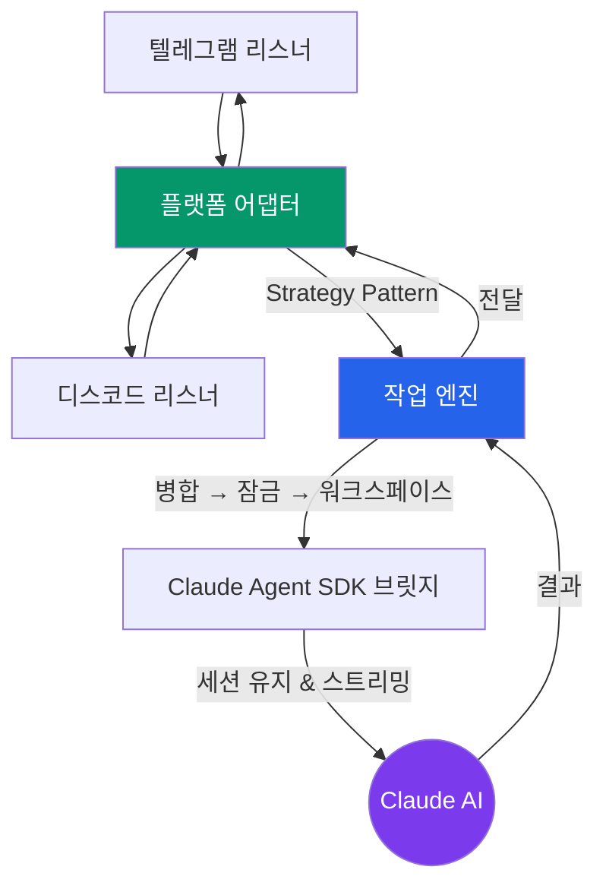
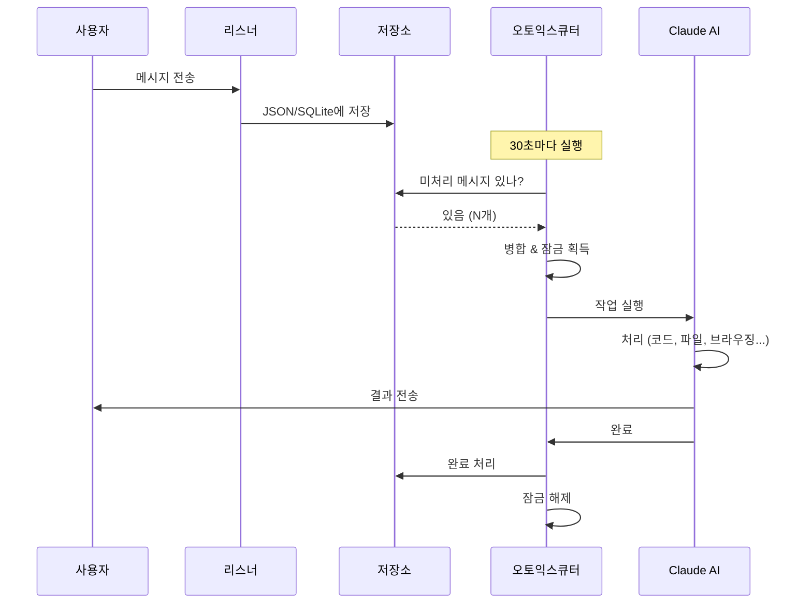
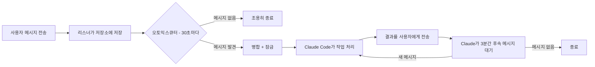
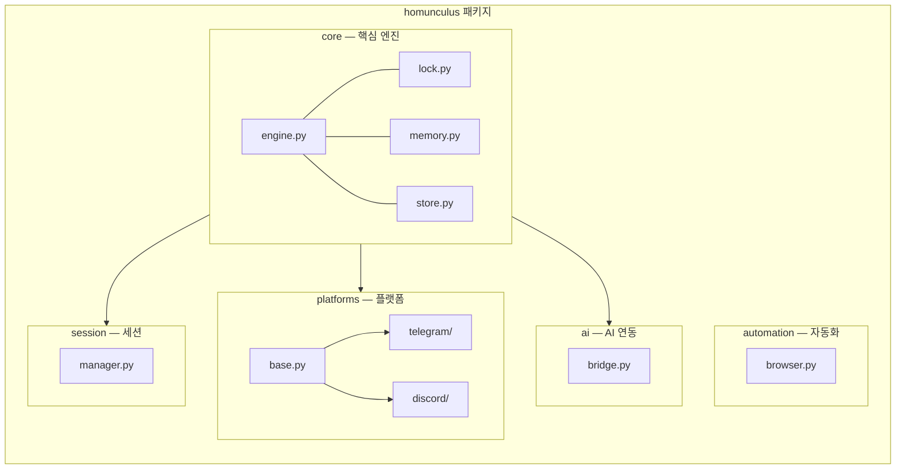
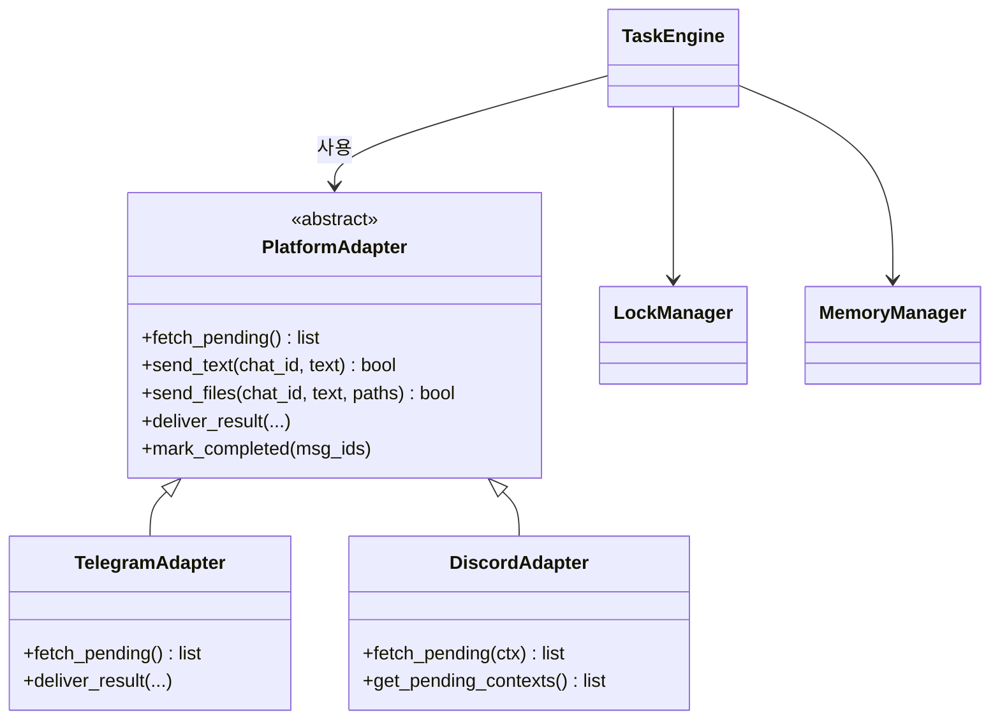

# Super Homunculus Bot

Claude AI 기반 멀티 플랫폼 챗봇 어시스턴트. **텔레그램**과 **디스코드**에서 자연어로 명령하면, AI가 코드 작성, 파일 생성, 웹 브라우징 등을 자율 수행하고 결과를 보고합니다.

> "연금술사의 호문쿨루스처럼, 만들어서 부리는 AI 심부름꾼"

## 아키텍처



## 메시지 처리 흐름



## 주요 기능

- **멀티 플랫폼**: 텔레그램 + 디스코드 통합 파이프라인
- **세션 연속성**: 봇 재시작 후에도 AI 대화를 이어감 (이전 대화 기억)
- **동시 실행 방지**: 파일 기반 잠금 + 스탈 감지 (30분 타임아웃)
- **작업 메모리**: 키워드 검색 가능한 과거 작업 인덱스
- **파일 지원**: 사진, 문서, 오디오, 비디오, 음성 메시지, 위치 공유
- **브라우저 자동화**: Playwright 기반 웹 스크래핑, 스크린샷, 폼 입력 (선택)
- **크로스 플랫폼**: macOS (launchd) / Linux (cron) / Windows (Task Scheduler)
- **자동 복구**: 좀비 프로세스와 멈춘 작업을 자동 감지하고 정리

## 이런 걸 할 수 있어요

봇에게 메시지를 보내면:

| 요청 | 동작 |
|------|------|
| "카페 랜딩페이지 만들어줘" | Claude가 HTML/CSS 파일을 만들어서 보내줌 |
| "이 PDF 요약해줘" (+ 파일 첨부) | 첨부 파일을 읽고 요약본 반환 |
| "example.com 스크린샷 찍어줘" | 브라우저 자동화로 캡처 후 전송 |
| "어제 뭐 시켰었지?" | 작업 메모리를 검색해서 과거 대화 회상 |
| "server.py 42번째 줄 버그 고쳐줘" | 코드를 읽고, 문제를 찾아서 수정 |

봇이 바쁠 때 보낸 여러 메시지는 **자동으로 합산**되어 다음 사이클에 함께 처리됩니다.

---

## 설치 가이드

### 사전 요구사항

- **Python 3.11+** — [다운로드](https://www.python.org/downloads/)
- **Claude Code CLI** — [설치 가이드](https://docs.anthropic.com/en/docs/claude-code)
- 텔레그램 및/또는 디스코드 계정

### 1단계: 프로젝트 설치

**macOS / Linux:**
```bash
git clone https://github.com/jskjw157/super_homunculus_bot.git
cd super_homunculus_bot
pip install -e ".[dev]"
```

**Windows:**
```
git clone https://github.com/jskjw157/super_homunculus_bot.git
cd super_homunculus_bot
scripts\setup.bat
```
setup.bat를 더블클릭하면 Python 확인 → 패키지 설치 → .env 생성을 자동으로 진행합니다.

**선택사항 — 브라우저 자동화:**
```bash
pip install -e ".[browser]"
playwright install chromium
```

### 2단계: 텔레그램 봇 만들기

1. 텔레그램을 열고 **[@BotFather](https://t.me/BotFather)**를 검색 (파란색 체크마크 확인)
2. 대화를 시작하고 `/newbot` 전송
3. **표시 이름 설정** — 예: "내 호문쿨루스"
4. **사용자명 설정** — `bot`으로 끝나야 함, 예: `my_homunculus_bot`
   - 5~32자, 영문 소문자, 숫자, 밑줄(_)만 사용 가능
5. BotFather가 **API 토큰**을 알려줌 — 이런 형식:
   ```
   123456789:ABCdefGHIjklMNOpqrSTUvwxYZ
   ```
6. **토큰을 복사** — `.env` 파일에 입력할 것

> **보안 주의:** 토큰은 봇의 비밀번호입니다. Git에 커밋하거나 공개하면 안 됩니다. 토큰이 유출되면 BotFather에서 `/revoke`를 보내 새 토큰을 발급받으세요.

**BotFather 추가 설정 (선택):**
- `/setdescription` — 봇 프로필에 표시되는 소개 문구 설정
- `/setuserpic` — 봇 프로필 사진 업로드
- `/setcommands` — 슬래시 명령어 힌트 등록 (예: `/help - 도움말 보기`)
- `/setprivacy` — 그룹 채팅에서 모든 메시지를 읽어야 하면 `Disable`로 설정

### 3단계: 디스코드 봇 만들기

1. **[Discord Developer Portal](https://discord.com/developers/applications)** 접속 및 로그인
2. **"New Application"** 클릭 → 이름 입력 (예: "Super Homunculus") → **Create**
3. 왼쪽 사이드바에서 **"Bot"** 탭 클릭
4. **"Reset Token"** 클릭 → 토큰을 **즉시 복사**
   - 디스코드는 토큰을 한 번만 보여줍니다! 안전한 곳에 저장하세요

5. **Privileged Intents 활성화** (Bot 페이지 아래로 스크롤):
   - **Message Content Intent** → ON으로 토글
   - **Server Members Intent** → ON으로 토글 (선택, 사용자 정보 필요 시)
   - **Save Changes** 클릭

   > **Message Content Intent가 왜 필요한가요?** 이것이 꺼져 있으면 봇이 메시지 내용을 빈 문자열로 받습니다. 사용자가 무엇을 입력했는지 읽으려면 반드시 켜야 합니다.

6. **초대 링크 생성** (봇을 서버에 추가):
   - 왼쪽 사이드바에서 **OAuth2** → **URL Generator** 클릭
   - **Scopes**에서 체크: `bot`, `applications.commands`
   - **Bot Permissions**에서 체크:
     - Send Messages (메시지 보내기)
     - Send Messages in Threads (스레드 메시지)
     - Attach Files (파일 첨부)
     - Read Message History (메시지 기록 읽기)
     - Add Reactions (반응 추가)
   - 하단에 생성된 URL을 복사 → 브라우저에서 열기
   - 서버 선택 → **승인** 클릭

> **참고:** 100개 미만 서버의 봇은 Privileged Intents를 자유롭게 사용 가능. 100개 이상이면 [검증 신청](https://support-dev.discord.com/hc/en-us/articles/6205754771351)이 필요합니다.

### 4단계: `.env` 설정

```bash
cp .env.example .env
```

`.env` 파일을 열어 토큰을 입력:
```env
# 텔레그램
TELEGRAM_BOT_TOKEN=123456789:ABCdefGHIjklMNOpqrSTUvwxYZ
TELEGRAM_ALLOWED_USERS=사용자_ID
TELEGRAM_POLLING_INTERVAL=10

# 디스코드
DISCORD_BOT_TOKEN=MTIzNDU2Nzg5.AbCdEf.GhIjKlMnOpQrStUvWxYz
DISCORD_GUILD_ID=서버_ID
DISCORD_ALLOWED_USERS=디스코드_사용자_ID
```

### 5단계: 사용자 ID 확인하기

**텔레그램:**
```bash
python scripts/get_my_id.py
# 봇에게 아무 메시지나 보내면 사용자 ID가 출력됩니다
```

또는 텔레그램에서 [@RawDataBot](https://t.me/RawDataBot)에게 메시지를 보내면 채팅 ID를 포함한 사용자 정보를 알려줍니다.

**디스코드:**
1. 디스코드 설정 → **고급** → **개발자 모드** 활성화
2. 자기 이름 우클릭 → **사용자 ID 복사**

서버(길드) ID: 서버 이름 우클릭 → **서버 ID 복사**

### 6단계: 봇 실행

**방법 A: 수동 실행 (테스트용)**
```bash
# 터미널 1 — 리스너 (메시지 수신)
python -m homunculus.platforms.telegram.listener

# 터미널 2 — 메시지 처리
python scripts/run_telegram.py
```

**방법 B: 자동 실행 (일상 사용 권장)**

오토익스큐터가 30초마다 새 메시지를 확인하고, 있으면 Claude Code를 실행합니다:

| OS | 명령어 | 설명 |
|----|--------|------|
| macOS | `bash scripts/setup_scheduler.sh` | `launchd` plist 등록 (30초 간격) |
| Linux | `bash scripts/setup_scheduler.sh` | cron 등록 (1분 간격) |
| Windows | `scripts\register_scheduler.bat` (관리자 실행) | Task Scheduler 등록 (30초 효과) |

**실행 확인:**
```bash
# macOS
launchctl list | grep homunculus

# Linux
crontab -l | grep autoexecutor

# Windows (PowerShell)
schtasks /Query /TN "Homunculus_*" /FO LIST
```

**로그 확인:**
```bash
tail -f logs/autoexecutor.log
```

---

## 작동 방식



1. **리스너**가 상시 실행되며, 수신 메시지를 JSON(텔레그램) 또는 SQLite(디스코드)에 저장
2. **오토익스큐터**가 OS 스케줄러를 통해 30초마다 실행
3. 미처리 메시지가 있으면 병합하고 파일 잠금 획득
4. **Claude Code**가 병합된 지시사항으로 실행
5. Claude가 작업을 처리하며, 중간 진행 상황을 사용자에게 전송
6. 완료 후 3분간 추가 메시지를 기다린 후 종료
7. 잠금이 해제되고 다음 사이클 시작

---

## 프로젝트 구조



| 모듈 | 역할 |
|------|------|
| `core/engine.py` | 작업 오케스트레이션 파이프라인 (병합 → 잠금 → 워크스페이스 → AI) |
| `core/lock.py` | 파일 기반 상호 배제 + 하트비트 + 스탈 감지 |
| `core/memory.py` | 작업 워크스페이스 관리 + 키워드 검색 인덱스 |
| `core/store.py` | SQLite 메시지 큐 (원자적 상태 전이) |
| `platforms/base.py` | `PlatformAdapter` 추상 클래스 (Strategy Pattern) |
| `platforms/telegram/` | 텔레그램 Bot API 어댑터, 센더, 리스너 |
| `platforms/discord/` | 디스코드 Gateway 어댑터, 센더, 리스너 |
| `ai/bridge.py` | Claude Agent SDK 래퍼 (세션 resume 지원) |
| `automation/browser.py` | 범용 Playwright 브라우저 자동화 (8개 명령) |
| `session/manager.py` | 멀티 플랫폼 세션 영속화/복원 |

## 디자인 패턴



## 새 플랫폼 추가하기

1. `homunculus/platforms/myplatform/` 디렉토리 생성
2. `MyPlatformAdapter(PlatformAdapter)` 구현
3. listener, sender 모듈 작성
4. `scripts/run_myplatform.py` 추가

엔진과 AI 브릿지는 수정할 필요 없습니다.

## 문제 해결

| 문제 | 해결 방법 |
|------|----------|
| 봇이 응답하지 않음 | `logs/autoexecutor.log`에서 에러 확인 |
| "TELEGRAM_BOT_TOKEN not configured" | `.env` 파일이 있는지, 토큰이 올바른지 확인 |
| 디스코드 봇은 온라인인데 메시지 무시 | Developer Portal에서 **Message Content Intent** 활성화 |
| "Lock already held" | 이전 작업이 아직 실행 중이거나 크래시됨 — 30분 후 자동 복구, 또는 `working.json` 삭제 |
| Claude Code를 찾을 수 없음 | Claude Code CLI 설치: `npm install -g @anthropic-ai/claude-code` |
| 여러 메시지가 합쳐지지 않음 | 다음 처리 사이클 (30초 이내)에 자동으로 합산됨 |

## 라이선스

MIT
