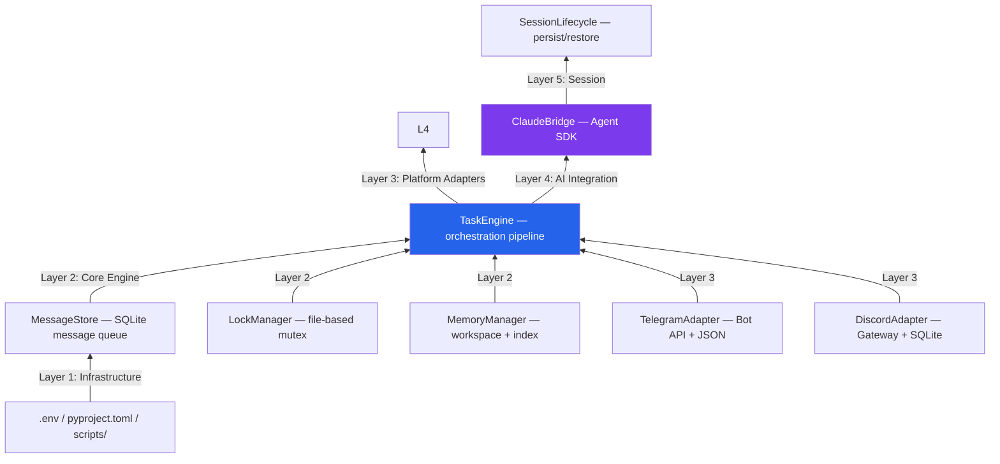
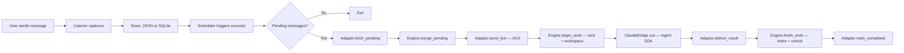
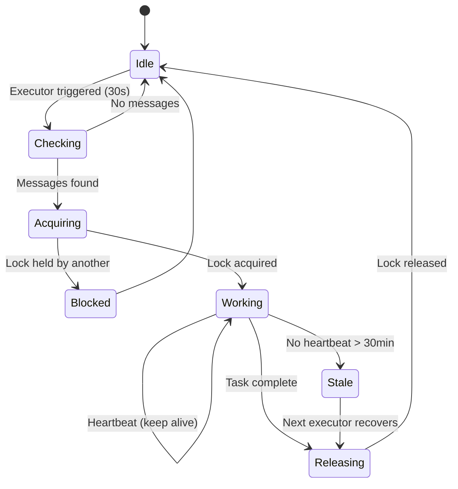
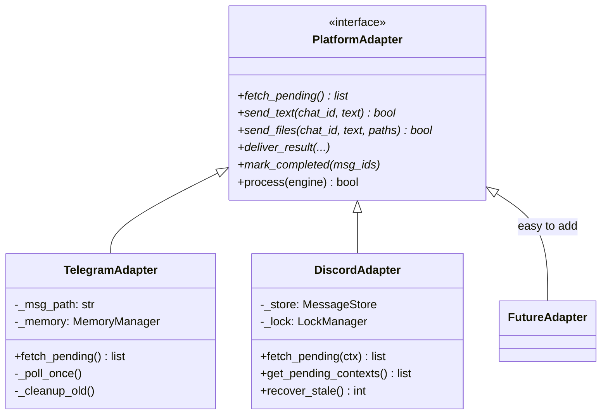

# Architecture

## Layer Diagram

```mermaid
graph BT
    L1[".env / pyproject.toml / scripts/"] -->|Layer 1: Infrastructure| L2
    L2[MessageStore — SQLite message queue] -->|Layer 2: Core Engine| L3
    L2b[LockManager — file-based mutex] -->|Layer 2| L3
    L2c[MemoryManager — workspace + index] -->|Layer 2| L3
    L3[TaskEngine — orchestration pipeline] -->|Layer 3: Platform Adapters| L4
    L4a[TelegramAdapter — Bot API + JSON] -->|Layer 3| L3
    L4b[DiscordAdapter — Gateway + SQLite] -->|Layer 3| L3
    L3 -->|Layer 4: AI Integration| L5[ClaudeBridge — Agent SDK]
    L5 -->|Layer 5: Session| L6[SessionLifecycle — persist/restore]

    style L5 fill:#7c3aed,color:#fff
    style L3 fill:#2563eb,color:#fff
```

## Data Flow

```mermaid
flowchart LR
    A[User sends message] --> B[Listener captures]
    B --> C[Store: JSON or SQLite]
    C --> D[Scheduler triggers executor]
    D --> E{Pending messages?}
    E -->|No| F[Exit]
    E -->|Yes| G[Adapter.fetch_pending]
    G --> H[Engine.merge_pending]
    H --> I[Adapter.send_text — ACK]
    I --> J[Engine.begin_work — lock + workspace]
    J --> K[ClaudeBridge.run — Agent SDK]
    K --> L[Adapter.deliver_result]
    L --> M[Engine.finish_work — index + unlock]
    M --> N[Adapter.mark_completed]
```

## Concurrency Model

```mermaid
stateDiagram-v2
    [*] --> Idle
    Idle --> Checking: Executor triggered (30s)
    Checking --> Idle: No messages
    Checking --> Acquiring: Messages found
    Acquiring --> Blocked: Lock held by another
    Blocked --> Idle
    Acquiring --> Working: Lock acquired
    Working --> Working: Heartbeat (keep alive)
    Working --> Releasing: Task complete
    Working --> Stale: No heartbeat > 30min
    Stale --> Releasing: Next executor recovers
    Releasing --> Idle: Lock released
```

## Platform Adapter Pattern

```mermaid
classDiagram
    class PlatformAdapter {
        <<interface>>
        +fetch_pending()* list
        +send_text(chat_id, text)* bool
        +send_files(chat_id, text, paths)* bool
        +deliver_result(...)*
        +mark_completed(msg_ids)*
        +process(engine) bool
    }

    class TelegramAdapter {
        -_msg_path: str
        -_memory: MemoryManager
        +fetch_pending() list
        -_poll_once()
        -_cleanup_old()
    }

    class DiscordAdapter {
        -_store: MessageStore
        -_lock: LockManager
        +fetch_pending(ctx) list
        +get_pending_contexts() list
        +recover_stale() int
    }

    PlatformAdapter <|-- TelegramAdapter
    PlatformAdapter <|-- DiscordAdapter
    PlatformAdapter <|-- FutureAdapter : easy to add
```
